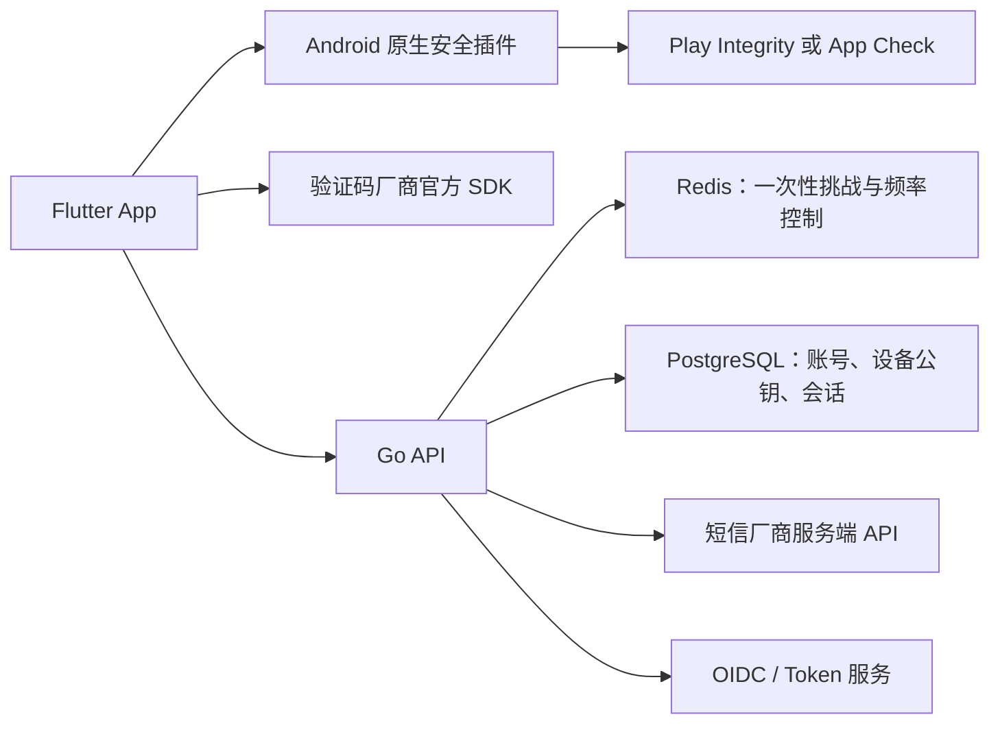

# Go 与 Flutter 安全登录栈

## 适用边界

本方案用于构建**自有后端**的安全登录 App，目标是实现“设备证明 + 人机验证 + 短信登录 + 可撤销续期”的安全能力。它不能复刻第三方服务端的密钥、风控画像、验证码会话或 `248` 判定规则。

## 推荐架构

Flutter 负责交互与调用受支持的原生能力；Go 后端验证所有证明并执行发码决定。客户端上报的机型、系统版本、User-Agent 或自定义设备码只能作为风险信号，不能作为可信边界。

## 方案 A：快速落地（Google/Firebase 依赖）

| 层 | 选型 | 作用 |
| --- | --- | --- |
| Flutter | `firebase_core`、`firebase_app_check`、`flutter_secure_storage` | 初始化 App Check、保存令牌，不保存验证码回执日志 |
| Android 原生 | Play Integrity Provider | 为受官方分发的 Android App 取得完整性证明 |
| Go API | `chi` 或 `gin`、`pgx`、`go-redis` | 挑战、验证码、会话与风控接口 |
| 后端验证 | Firebase Admin Go SDK / Google 官方服务端接口 | 校验 App Check 或完整性证明 |
| 存储 | PostgreSQL + Redis | 持久化账号/设备公钥；Redis 保存短时一次性挑战 |
| 短信与验证码 | 各厂商官方服务端 API、官方 Android SDK | 后端决定发送，厂商服务端验证回执 |

适合应用分发和用户网络环境支持 Google Play/Firebase 的场景。官方能力入口： [Play Integrity](https://developer.android.com/google/play/integrity/standard)、[Firebase App Check Android Provider](https://firebase.google.com/docs/app-check/android/play-integrity-provider)、[Flutter App Check](https://firebase.google.com/docs/app-check/flutter/default-providers)。

## 方案 B：自建可控（Go 为中心）

| 层 | 选型 | 作用 |
| --- | --- | --- |
| Flutter | `flutter_secure_storage` + 私有 platform channel | 令牌安全存储；调用 Kotlin 原生插件 |
| Android 原生插件 | Android Keystore、可选 Key Attestation、可选 Play Integrity | 生成不可导出的设备签名私钥，并对服务端 nonce 签名 |
| Go API | `chi`、`pgx`、`go-redis`、标准库 `crypto` | 验证 ECDSA 签名、管理挑战与风险策略 |
| 身份层 | Ory Kratos/Hydra 或既有 OIDC 服务 | 账号恢复、会话和 OAuth/OIDC 协议能力 |
| 短信与验证码 | 合规短信服务商 + 验证码厂商官方 SDK/服务端验证 API | 不依赖第三方 App 的私有接口 |

适合需要自主管理数据、面向无 Google Play 环境分发，或已有 Go 身份平台的场景。Android Keystore 是密钥保存与设备签名的基础；是否启用 Key Attestation、Play Integrity 取决于设备覆盖、分发渠道和误判成本。官方说明：[Android Keystore](https://developer.android.com/privacy-and-security/keystore)、[Ory 文档](https://www.ory.sh/docs/)。

## 最小安全协议

1. App 向 Go 服务端申请登录挑战；服务端在 Redis 保存随机 nonce、过期时间、账号上下文和频率状态。
2. App 用 Android Keystore 中的设备私钥签名 nonce，并附带完整性证明或 App Check token。
3. Go 服务端校验证明和签名，再创建仅能使用一次的验证码挑战。
4. 用户在官方验证码 SDK 内完成验证；App 将厂商回执发给 Go 后端，由 Go 调用厂商的服务端验证接口。
5. 验证成功后，Go 后端调用短信厂商 API；验证码校验成功才签发短期 access token 和可轮换、可撤销的 refresh token。
6. 每次刷新 token 都轮换 refresh token，并绑定设备公钥；异常时撤销整个设备会话。

## 自有 `devCode` 的正确实现

可以实现 `devCode`，但它应是服务端签发的**设备记录 ID**，而不是安全凭据。建议的生命周期如下：

1. Flutter 通过 Kotlin platform channel 让 Android Keystore 生成不可导出的 ECDSA 设备私钥，并将公钥或证书发送到 Go 后端注册。
2. Go 后端创建设备记录，生成随机、不含设备信息的 `devCode`，并保存设备公钥、账号关联、状态和最近活动时间。客户端只保存该 ID 与 Keystore key alias。
3. 每次敏感请求前，后端签发一次性 nonce；原生插件使用设备私钥对 nonce、请求方法、路径和请求体摘要签名。
4. Go 后端根据 `devCode` 找到公钥，验证签名、nonce 状态和可选完整性证明。仅标识一致但无法证明持有私钥的请求必须拒绝。
5. 卸载、清除应用数据或 Keystore 密钥失效后，设备不能继续证明旧身份；在完成账号认证后重新注册为新设备。后台可让用户查看和撤销历史设备。

推荐数据模型为 `devices(id, user_id, public_key, status, integrity_state, created_at, last_seen_at)`。日志只记录 `devCode` 的不可逆关联值或内部设备记录 ID，不记录公钥证明、nonce、验证码或 Android ID。

这样，`devCode` 可满足“长期识别同一安装实例”的产品需求，但即使泄露也不能单独冒充设备；实际安全性来自 Android Keystore 私钥与服务端一次性挑战的组合。

## 客户端 API key 的边界

大 App 的安装包中经常可见 API key、项目 ID、验证码 site key 或 SDK app key；这不表示其登录后端可以被第三方直接调用。应按以下边界设计：

| 材料 | 可否出现在客户端 | 安全含义 |
| --- | --- | --- |
| 地图、分析、验证码展示等 public/site key | 可以 | 假定可被提取；仅做项目标识、配额或平台限制，不能证明用户/设备身份 |
| `devCode` / 设备记录 ID | 可以 | 仅定位服务端设备记录，必须配合私钥签名 |
| 设备私钥 | 不可以导出 | 仅留在 Android Keystore，用来生成每次请求的证明 |
| 短信厂商服务端密钥、验证码验证 secret、JWT 私钥、数据库凭据 | 不可以 | 仅保存在 Go 后端的受控密钥系统中 |
| 完整性和验证码回执 | 可以在请求中传输 | 短时、一次性；后端校验后不得写入日志 |

公开 key 仍应配置厂商支持的包名、签名证书、应用 ID、来源或配额限制；但这些限制只是降低滥用面，不能替代服务端认证。若产品向第三方开发者开放正式 API，则应提供单独的 OAuth/OIDC 或受限 API key 合约、权限范围、配额和撤销机制，而不能复用 App 自身的登录接口。

## 必须避免的设计

- 不用 UUID、Android ID 或请求头充当唯一设备身份。
- 不让客户端自行决定是否发送短信，也不相信客户端声称的验证码成功。
- 不在日志、分析系统或崩溃上报中记录验证码、验证码厂商回执、token 或设备证明原文。
- 不把证书锁定、代码混淆或 User-Agent 检查当作核心反滥用能力；它们只能增加攻击成本。
- 不用“网络异常”掩盖所有拒绝。对受信客户端至少区分验证码失效、频率限制、完整性不满足与上游服务故障。

## 选择建议

若目标是尽快上线 Android 首版，优先方案 A；若需要自建身份、兼顾国内分发或避开 Firebase 依赖，优先方案 B。无论选择哪一套，验证码厂商应使用正式合同、SDK 与服务端验证接口，不应尝试调用或模拟其他 App 的私有登录接口。
